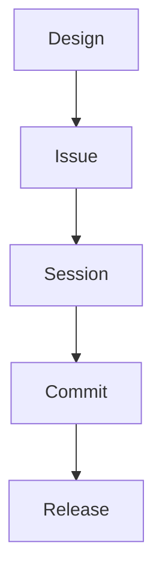

# Roadmap – Fontshow

This document describes the **actual state of the Fontshow project** as of version **v0.28.7**,
aligning milestones, GitHub issues, and the intended evolution path.
It is a **living document**, manually updated whenever a milestone is closed or redefined.

## Status and role of this document

This roadmap is a **strategic, non-normative** document.

It provides a high-level view of the intended direction of the project,
but it is **not** the authoritative source for scope, sequencing,
or implementation details.

The canonical and normative source of truth for planning is the
**Planning Document Set**:

- [`docs/planning/00_Planning_Document_Set.md`](planning/00_Planning_Document_Set.md)

This roadmap is derived from, and must remain consistent with, the planning set.
In case of discrepancies, the planning documents always take precedence.

---

This document outlines the planned evolution of the Fontshow project.

---

## Development Workflow Overview

```txt
Design
  |
  v
Issue
  |
  v
Session
  |
  v
Commit
  |
  v
Release
```

<details>
<summary>Mermaid diagram (visual aid)</summary>



</details>

### Rules

- No code during Design
- No design during Issue
- No scope changes during Session
- No planning during Commit
- No refactoring during Release

---

## 📍 Current status

- **Version**: v0.28.7.post9
- **Milestone**: **C5 – COMPLETED**
- **Current focus**: consolidation, manual testing, robustness

---

## ✅ Completed work

The following activities should be considered **completed or absorbed** in the current codebase:

- **C5** – Stable end-to-end pipeline (preflight → dump → parse → LaTeX)
- Font inventory validation (versioned schema, explicit validation)
- Clear separation between:
  - preflight (capability-based checks)
  - Linux/fontconfig-based pipeline
- Deterministic LaTeX generation
- Baseline architectural documentation (`docs/`)

> Note: not all historical GitHub issues are formally closed,
> but the code reflects a coherent and consolidated state.

---

## 🧪 Ongoing activities (post-C5)

These activities **do not introduce new features**, but aim to improve reliability
and documentation quality:

- **#8 – Manual Testing Documentation**
  Manual test documentation for:
  - Gentoo
  - Fedora
  - WSL
  - Windows (if applicable)

- **#1 – Native Linux testing**
  Validation of `fc-query` behavior and charset extraction on Gentoo

---

## ⏳ Planned / pending activities

- **#4 – LaTeX debugging facilities**
  Debug and diagnostic options (no implementation started yet)

- **#5 – LuaLaTeX robustness tests**
  Tests targeting problematic or edge-case fonts

- **#9 – Packaging & CLI UX**
  CLI entry-point rationalization (explicitly deferred)

---

## 💤 Parked activities (future milestones)

- **#12 – CI & Automation**
  Planned only after manual testing has stabilized

- **#25 – Pluggable font discovery backend**
  Future architecture (v2.x.y), **explicitly out of scope** for the 0.x series

---

## 📌 Governance notes

- This roadmap **does not replace** GitHub issues
- It serves as:
  - a high-level overview
  - an orientation tool for upcoming milestones
- Future milestones (C6, C7, …) will be defined **only after**:
  - completion of manual testing
  - LaTeX robustness consolidation

---

### Last updated: 12/01/2026, v0.28.7.post9
